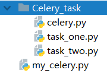

Celery 是一个简单、灵活且可靠的，处理大量消息的分布式系统，并且提供维护这样一个系统的必需工具。

它是一个专注于实时处理的任务队列，同时也支持任务调度。

是基于Python实现的模块, 用于执行异步定时周期任务的

<!--more-->

其结构的组成是由:

- ​    用户任务 app
- ​    管道 broker 用于存储任务 官方推荐 redis rabbitMQ  / backend 用于存储任务执行结果的
- ​    员工 worker

# Celery的简单实例

`part_one.py`:

```python
import time
from celery import Celery

#创建一个Celery实例,这就是我们用户的应用app
my_task = Celery("tasks", broker="redis://127.0.0.1:6379", backend="redis://127.0.0.1:6379")

# 为应用创建任务,func1
@my_task.task
def func(x, y):
    time.sleep(15)
    return x + y
```

`part_two.py`:

```python
from part_one import func

# 将任务交给Celery的Worker执行
res = func.delay(2,4)

#返回任务ID
print(res.id)
```

`part_three`:

```python
from celery.result import AsyncResult
from part_one import my_task

# 异步获取任务返回值
async_task = AsyncResult(id="31ec65e8-3995-4ee1-b3a8-1528400afd5a",app=my_task)

# 判断异步任务是否执行成功
if async_task.successful():
    #获取异步任务的返回值
    result = async_task.get()
    print(result)
else:
    print("任务还未执行完成")
```

三个文件创建完成了,现在开始分析哪个文件是app,哪个文件是borker,哪个是worker;最终我们要执行的任务是在 part_one.py 中,也就是worker需要执行的任务,所以worker就是 part_one.py了

## 如何启动worker

> Linux - celery worker -A s1 -l INFO 
> Windows:这里需要注意的是celery 4.0 已经不再对Windows操作系统提供支持了,也就是在windows环境下出现问题除非自己解决,否则官方是不会给你解决的
> Windows - celery worker -A s1 -l INFO -P eventlet
> `ps:` eventlet 是一个python的三方库 需要使用 pip安装 pip install eventlet

启动完成,其实在part_one.py当中,worker已经知道了自己的broker 和 backend 在哪里了
接下来就让异步任务开始执行吧,对了 part_two.py 中就是使用 delay 的方式来开始执行的异步任务
执行 part_two .py 得到了一个字符串 55a84ea3-afa4-4ab9-8650-40e156c07441 这个字符串儿就是异步任务的ID

然后通过part_three.py修改异步任务的ID来获取任务返回的结果

# Celery项目目录



目录Celery_task这个名字可以随意起,但是一定要注意在这个目录下一定要有一个celery.py这个文件

`celery.py`:

```python
from celery import Celery

celery_task = Celery("task",
                     broker="redis://127.0.0.1:6379",
                     backend="redis://127.0.0.1:6379",
                     include=["Celery_task.task_one","Celery_task.task_two"])
# include 这个参数适用于寻找目录中所有的task
```

`task_one.py`:

```python
from .celery import celery_task
import time

@celery_task.task
def one(x,y):
    time.sleep(5)
    return f"task_one {x+y}"
```

`task_two.py`:

```python
import time
from .celery import celery_task

@celery_task.task
def two(x,y):
    time.sleep(5)
    return f"task_two {x+y}"
```

这样Celery项目目录结构就已经做好了然后再 my_celery中调用

```python
from Celery_task.task_one import one
from Celery_task.task_two import two
 
one.delay(10,10)
two.delay(20,20)
```

`PS:`启动Worker的时候无需再使用文件启动,直接启动你的Celery_task目录就行了
celery worker -A Celery_task -l INFO -P eventlet
这样celery就可以自动的去检索当前目录下所有的task了,通过Include这个参数逐一去寻找

# Celery定时任务

我们还使用Celery_task这个示例来修改一下
my_celery中进行一下小修改

```python
from Celery_task.task_one import one
from Celery_task.task_two import two

# one.delay(10,10)
# two.delay(20,20)

# 定时任务我们不在使用delay这个方法了,delay是立即交给task 去执行
# 现在我们使用apply_async定时执行

#首先我们要先给task一个执行任务的时间
import datetime,time
# 获取当前时间 此时间为东八区时间
ctime = time.time()
# 将当前的东八区时间改为 UTC时间 注意这里一定是UTC时间,没有其他说法
utc_time = datetime.datetime.utcfromtimestamp(ctime)
# 为当前时间增加 10 秒
add_time = datetime.timedelta(seconds=10)
action_time = utc_time + add_time

# action_time 就是当前时间未来10秒之后的时间
#现在我们使用apply_async定时执行
res = one.apply_async(args=(10,10),eta=action_time)
print(res.id)
#这样原本延迟5秒执行的One函数现在就要在10秒钟以后执行了
```

# Celery周期任务

首先要对Celery_task中的celery.py进行一点修改:

```python
from celery import Celery
from celery.schedules import crontab

celery_task = Celery("task",
                     broker="redis://127.0.0.1:6379",
                     backend="redis://127.0.0.1:6379",
                     include=["Celery_task.task_one","Celery_task.task_two"])

#我要要对beat任务生产做一个配置,这个配置的意思就是每10秒执行一次Celery_task.task_one任务参数是(10,10)
celery_task.conf.beat_schedule={
    "each10s_task":{
        "task":"Celery_task.task_one.one",
        "schedule":10, # 每10秒钟执行一次
        "args":(10,10)
    },
    "each1m_task": {
        "task": "Celery_task.task_one.one",
        "schedule": crontab(minute=1), # 每一分钟执行一次
        "args": (10, 10)
    },
    "each24hours_task": {
        "task": "Celery_task.task_one.one",
        "schedule": crontab(hour=24), # 每24小时执行一次
        "args": (10, 10)
    }

}

#以上配置完成之后,还有一点非常重要
# 不能直接创建Worker了,因为我们要执行周期任务,所以首先要先有一个任务的生产方
# celery beat -A Celery_task
# celery worker -A Celery_task -l INFO -P eventlet
```

创建Worker的方式并没有发行变化,但是这里要注意的是,每间隔一定时间后需要生产出来任务给Worker去执行,这里需要一个生产者beat

celery beat -A Celery_task  # 创建生产者 beat 你的 schedule 写在哪里,就要从哪里启动

celery worker -A Celery_task -l INFO -P eventlet

 创建worker之后,每10秒就会由beat创建一个任务给Worker去执行