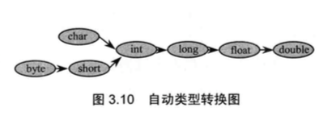
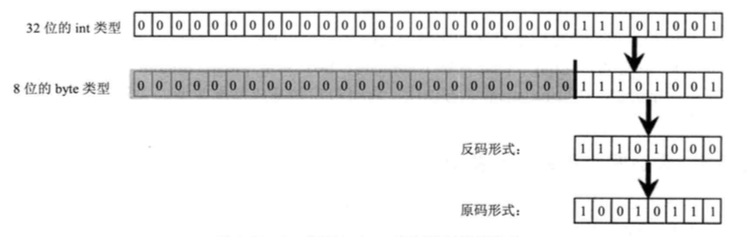
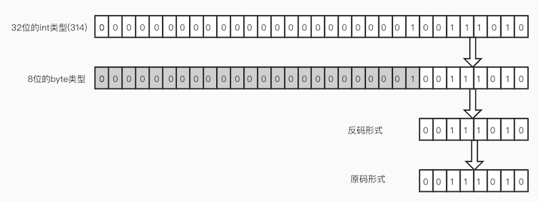

# 数据类型分类

Java语言时强类型语言，强类型包括两个含义：

- 所有变量必须先声明，后使用。
- 指定类型的变量只能接受类型与之匹配的值。

Java语言支持的类型分为两类：基本数据类型和引用类型。

- 基本类型包括布尔类型和数值类型。数值型类有整数类型和浮点类型。整数类型包括byte，short，int，long，char；浮点类型包括float，double。
- 引用类型包括类，接口和数值类型和一种特殊的null类型。所谓引用类型就是对一个对象的引用，实际上就是一个指针。

<!--more-->

## 整型

通常所说的整型，就是指下面的四种类型：

| 类型  | 字节 |  位  |     范围      |
| :---: | :--: | :--: | :-----------: |
| byte  |  1   |  8   |   -128～127   |
| short |  2   |  16  | -32768～32767 |
|  int  |  4   |  32  | -2^31~2^31-1  |
| long  |  8   |  64  | -2^63~2^63-1  |

### 进制表示：

Java中整数有4种表示方式：十进制，二进制，八进制，和十六进制

```
int a = 10;  // 十进制整数
int b = 0b1010;  // 使用0b或0B开头表示二进制整数
int c = 010;  // 使用0开头表示八进制整数
int d = 0x10; // 使用0x或者0X开头表示十六进制整数
```

tip：

​	所有数字在计算机底层都是以二进制形式存在的，原码是直接将一个数据换算成二进制数，但是计算机以补码的形式保存所有的整数。正数的补码和其原码相同，负数的补码是其反码+1；反码是对原码(最高位符号位不变)按位取反。

```
int b = 0b11010100;
最高位=1，为负数
原码=11010100
反码=10101011
补码=10101100
```

### 字符型

字符型通常用于表示单个字符，字符型值必须使用单引号`'`括起来。char类型的变量，值完全可以参与数学运算，也可以比较大小，实际上都是用该字符对应的编码参与运算。如果把0～65535范围内的一个int整数赋值给char类型变量，系统会自动把这个int整型当成char类型来处理。

## 浮点型

Java的浮点类型有两种：float和double

double类型代表双精度浮点数，float类型代表单精度浮点数。一个double类型数值占8字节，64位；一个float类型的数值占4字节，32位。

```
float a = 3.141592653579f;  // print = 3.1415927
double b = 3.141592653579;  // print = 3.141592653579 精度更高
```

Java语言的浮点数有两种表示形式

- 十进制数表示。5.12，520.0。浮点数必须包含一个小数点，否则会被当成int类型处理。

- 科学计数法表示。5.12e2(5.12x10^2), 5.12E2(5.12x10^2)

- java还提供了三个特殊的浮点数值：正无穷大，负无穷大和非数

  ```
  3/0.0  // 正数/0.0得到正无穷大Infinity
  -3/0.0  // 负数/0.0得到负无穷大Infinity
  0/0.0  // 0/0.0得到非数NaN,非数不与任何数值相等，甚至和NaN都不相等
  ```

**数值中使用`_`分隔**

当程序中的数值位数特别多时，java允许使用`_`分隔数值

```
int a = 1_000_000;
float b = 3.14_15926f;
```

## 布尔类型

`true`和`false`

## 基本类型的类型转换

### 自动类型转换

java的所有数值类型变量可以互相转换，如果系统支持把某种基本类型的值直接赋给另一个基本类型的变量，则这种方式被称为自动类型转换。当把一个表数范围小的数值或变量直接赋值给另一个表数范围大的变量时，系统将可以进行自动类型转换，否则需要强制类型转换。



当把任何基本类型的值和字符串值进行连接运算时，基本类型的值将自动类型转换为字符串类型。

```
short a = 12;
int b = a;  // 自动类型转换
System.out.println(3 + 4 + "hello"); // "7hello"
System.out.println("hello"+ 3 + 4); // "hello34"
```

### 强制类型转换

强制类型转换的语法格式是：`(targetType) value`,当强制类型转换时如果，将表数范围大的转换成表数范围小的，会造成`缩小转换`	

```)
double a = 3.14;
(int) a; // 3浮点数转换整数时，小数部分会被丢弃
int b = 233;
int c = 314;
(byte) b;  // -23 发生溢出
(byte) c;  // 58 发生溢出
```

b类型转换溢出情况：



c类型转换溢出情况：



