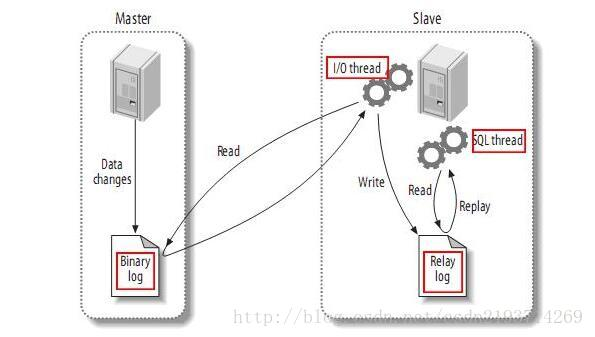

# MariaDB

> MariaDB数据库管理系统是MySQL的一个分支，主要由开源社区在维护，采用GPL授权许可。
> 开发这个分支的原因之一是：甲骨文公司收购了MySQL后，有将MySQL闭源的潜在风险，因此社区采用分支的方式来避开这个风险。
> MariaDB的目的是完全兼容MySQL，包括API和命令行，使之能轻松成为MySQL的代替品。
>
> <!--more-->

此文以mariadb的安装为例!

## yum和源码编译安装的区别

> 1.路径区别-yum安装的软件是他自定义的，源码安装的软件./configure --preifx=软件安装的绝对路径
> 2.yum仓库的软件，版本可能比较低，而源码编译安装，版本可控
> 3.编译安装的软件，支持第三方功能扩展./configure  这里可以加上很多参数，定制功能

## 阿里yum安装

```
yum install mariadb-server  mariadb -y  
```

使用阿里云的yum时,阿里云的mariadb包名是小写的，而官方的是大写的！！！！注意的

## 官方yum源安装

当阿里云提供的yum仓库或epel源仓库，它的mariadb版本很低时,我们的就需要使用官方的yum源

- 配置官方的mariadb的yum源，手动创建 mariadb.repo仓库文件

    > - touch /etc/yum.repos.d/mariadb.repo 
    > - 然后写入如下内容:
    > - ​	[mariadb]
    > - ​	name = MariaDB
    > - ​	baseurl = http://yum.mariadb.org/10.1/centos7-amd64
    > - ​	gpgkey=https://yum.mariadb.org/RPM-GPG-KEY-MariaDB
    > - ​	gpgcheck=1

- 通过yum安装mariadb软件

    ```shell
    yum install MariaDB-server MariaDB-client -y
    ```

# MySQL使用

## 启动MySQL

启动服务端

> systemctl  start/stop/restart/status  mariadb 
> systemctl enable mariadb   # 设置开机启动mariadb

## MySQL初始化

```
mysql_secure_installation 
```

这条命令可以初始化mysql，删除匿名用户，设置root密码等等....

## 中文编码支持

- 修改/etc/my.cnf配置文件

    > 在[mysqld]中添加参数，使得mariadb服务端支持中文:
    > ​	[mysqld]
    > ​	character-set-server=utf8
    > ​	collation-server=utf8_general_ci

- 重启mariadb服务，读取my.cnf新配置

    ```mysql
    systemctl restart mariadb 
    ```

- 登录数据库，查看字符编码

    ```mysql
    mysql -uroot -p
    ```

- 输入 \s  查看编码 

# MySQL常用命令

```mysql
desc  # 查看表结构
create database  # 数据库名
create table  # 表名
show create  database  库名  		 # 查看如何创建db的
show create table 表名;			# 查看如何创建table结构的

# 修改mysql的密码
set password = PASSWORD('redhat');

# 创建mysql的普通用户，默认权限非常低
create user username@'%' identified by 'userpwd';

# 查询mysql数据库中的用户信息
use mysql;
select host,user,password  from user;
```

## 用户添加权限命令

```mysql
grant all privileges on *.* to 账户@主机名   　　 # 对所有库和所有表授权所有权限
grant all privileges on *.* to yining@'%';       # 给yining用户授予所有权限
flush privileges;		 # 刷新授权表
grant all privileges on *.* to yining@'%';       # 给yining用户授予所有权限
grant all privileges on *.* to root@'%' identified by 'redhat';  # 给与root权限授予远程登录的命令
# 此时可以在windows登录linux的数据库 mysql -uyining -p  -h  服务器的地址  	连接服务器的mysql
```

## 数据备份与恢复 

导出当前数据库的所有db，到一个文件中

```mysql
mysqldump -u root -p --all-databases > /data/db.dump
```

进行数据恢复，把刚才重定向备份的数据库文件导入到mysql中

```mysql
mysql -uroot -p   <   /data/db.dump  #在登录时候，导入数据文件，一样可以写入数据
```


# MYSQL主从复制

MySQL数据库的主从复制方案，是其自带的功能，并且主从复制并不是复制磁盘上的数据库文件，而是通过binlog日志复制到需要同步的从服务器上。

MySQL数据库支持单向、双向、链式级联，等不同业务场景的复制。在复制的过程中，一台服务器充当主服务器（Master），接收来自用户的内容更新，而一个或多个其他的服务器充当从服务器（slave），接收来自Master上binlog文件的日志内容，解析出SQL，重新更新到Slave，使得主从服务器数据达到一致。

主从复制的逻辑有以下几种:

- 一主一从，单向主从同步模式，只能在Master端写入数据

- 一主多从


双主主复制逻辑架构，此架构可以在Master或Master2进行数据写入，或者两端同事写入（特殊设置）


> 在生产环境中，MySQL主从复制都是异步的复制方式，即不是严格的实时复制，但是给用户的体验都是实时的。
> MySQL主从复制集群功能使得MySQL数据库支持大规模高并发读写成为可能，且有效的保护了服务器宕机的数据备份。
>
> `应用场景:`
>
> 利用复制功能当Master服务器出现问题时，我们可以人工的切换到从服务器继续提供服务，此时服务器的数据和宕机时的数据几乎完全一致。
> 复制功能也可用作数据备份，但是如果人为的执行drop,delete等语句删除，那么从库的备份功能也就失效了.

主从机制实现原理



> 1. master将改变记录到二进制日志(binary log)中（这些记录叫做二进制日志事件，binary log events）； 
> 2. slave将master的binary log events拷贝到它的中继日志(relay log)； 
> 3. slave重做中继日志中的事件，将改变反映它自己的数据。

## master主库配置

修改配置文件vim  /etc/my.cnf

> [mysqld]
> server-id=1 			        # 标注 主库的身份id
> log-bin=mysql-bin		# 那个binlog的文件名

重启mariadb,`systemctl start mariadb`

查看主库的状态, `mysql -uroot -p `

`show master status;`  # 这个命令可以查看 日志文件的名字，以及数据起始点 

- master主库添加从库账号

```mysql
create user 'yaoshao'@'%' identified by 'yaoshaopwd';
```

- 授予主从同步账号的，复制数据的权限

```mysql
grant replication slave on *.* to 'yaoshao'@'%';
```

- 进行数据库的锁表，防止数据写入

```mysql
flush table with read lock;
```

- 数据导出

```mysql
mysqldump -u root -p --all-databases >  /opt/zhucong.dump
```

- 将主库的数据，发送给从库

```mysql
scp /opt/zhucong.dump   root@从库:/opt/
```

- 解锁主库，恢复可写

```mysql
unlock tables;
```

- 此时就可以去从库的mysql上，登录，导入主库的数据，保持数据一致性

```mysql
mysql -uroot -p 
source /opt/zhucong.dump 
```


## slave从库配置

- 写入my.cnf，从库的身份信息

> vi /etc/my.cnf :
> ​	[mysqld]
> ​	server-id=10

- 重启数据库
- 检查一下主库和从库的 参数信息 

```mysql
show variables like 'server_id';
show variables like 'log_bin';
```

- 配置复制的参数，Slave从库连接Master主库的配置

> mysql > change master to master_host='192.168.13.78',
> master_user='yaoshao',
> master_password='yaoshaopwd',
> master_log_file='mysql-bin.000001',
> master_log_pos=571;

- 启动从库的同步开关

```mysql
start slave;
```

- 查看复制状态

```mysql
show slave status\G;
```

- 查看两条参数 ，确保主从正常

> Slave_IO_Running: Yes
> Slave_SQL_Running: Yes

注意此处还未配置从库的只读模式，只需在slave服务器上配置/etc/my.cnf，加上以下配置，并且在slave上创建普通用户，使用普通用户主从同步即可达到只读的效果

如果用root用户，无法达到readonly

> [mysqld]
> character-set-server=utf8
> collation-server=utf8_general_ci
> log-error=/var/log/mysqld.log
> server-id=3
> read-only=true
> [client]
> default-character-set=utf8
> [mysql]
> default-character-set=utf8

