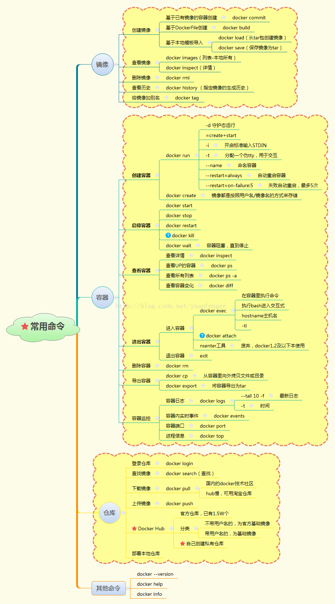

杂记:

<!--more-->

通过装饰器实现对函数的调用频率做限制.

```python
import time
from functools import wraps

def decorator(func):

    cache = {}  # 函数的缓存结果,不可变,键值对{函数名:最近一次的访问时间}
    allow_time = 10  # 访问限制时间

    @wraps(func)
    def inner(*args, **kwargs):
        # 函数的名称作为key
        key = func.__name__
        result = None
        if key in cache.keys():
            last_called_time = cache[key]
            # 过期时间
            if time.time() - last_called_time < 10:
                print(f"Please try again in {int(10 - time.time() + last_called_time)} second")
                result = 1  # 访问频繁 result 不为空
            else:
                result = None

        # 如果过期，或则没有缓存调用方法
        # result的值控制函数可否被调用
        if result is None:
            cache[key] = time.time()
            ret = func(*args, **kwargs)
            return ret
    return inner     
```

git速查表


docker速查

