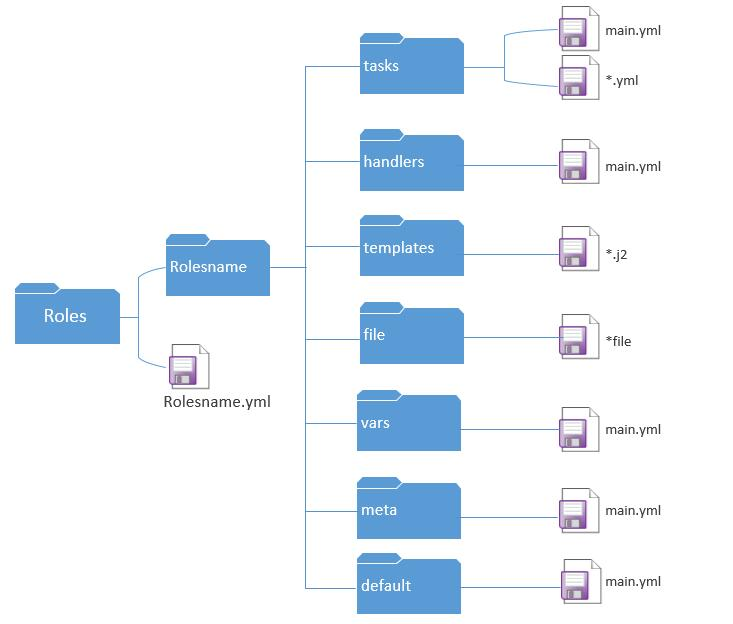

ansible是新出现的自动化运维工具，基于Python开发，集合了众多运维工具（puppet、cfengine、chef、func、fabric）的优点，实现了批量系统配置、批量程序部署、批量运行命令等功能。

<!--more-->

ansible是基于模块工作的，本身没有批量部署的能力。真正具有批量部署的是ansible所运行的模块，ansible只是提供一种框架。主要包括：

(1)、连接插件connection plugins：负责和被监控端实现通信；

(2)、host inventory：指定操作的主机，是一个配置文件里面定义监控的主机；

(3)、各种模块核心模块、command模块、自定义模块；

(4)、借助于插件完成记录日志邮件等功能；

(5)、playbook：剧本执行多个任务时，非必需可以让节点一次性运行多个任务。

# 安装

下载epel源

```python
wget -O /etc/yum.repos.d/epel.repo http://mirrors.aliyun.com/repo/epel-7.repo
```

安装ansible

```python
yum install -y ansibleshell
```

控制节点需要安装: `salt-master`

被控节点需要安装: `salt-minion`

# 批量在远程主机上执行命令

ansible 是通过ssh来连接并控制被控节点,ssh 的认证方式包括:

- 密码连接

- 秘钥连接

    ```python
    ssh-keygen # 用来生成ssh的密钥对
    ssh-copy-id 192.168.107.131 # 复制秘钥到远程主机,实现秘钥连接
    ```

## ansible 命令格式

```python
ansible <host-pattern> [options]
	-a MODULE_ARGS/--args=MODULE_ARGS  # 模块的参数
	-C, --check 					 # 检查
	-f FORKS/--forks=FORKS 		      # 用来做高并发的
	--list-hosts 					 # 列出主机列表
 	-m MODULE_NAME 					 # 模块名称
 	--syntax-check 					 # 语法检查
 	-k 								# 输入密码
```

## ansible hosts

```python
cat /etc/ansible/hosts 
```

## host-pattern

```python
hosts中添加:
[group]
ip1
ip2
# 建立分组
# 系统自带的ping使用的是ICMP协议
- 单个的主机 # ansible 192.168.10.130 -m ping
- 全部主机 # ansible all -m ping/ansible "*" -m ping
- 多个的主机 # ansible 192.168.10.130,192.168.10.131 -m ping
- 单个组 # ansible group1 -m ping
- 多个组
    - 交集  "group1：&group2"
    - 并集
        - group1，group2
        - group1：group2
    - 差集 ‘group1：！group2’
```

## ansible-doc查看模块的帮助信息

```python
ansible-doc [-l|-F|-s] [options] [-t <plugin type> ] [plugin]
 	-j # 以json的方式返回ansible的所有模块
    -l, --list # 列出所有的ansible的模块
   	-s # 以片段式显示ansible的帮助信息
```

## 命令相关模块

### command

```python
ansible group -a 'useradd yao' # 通过ansible在group组中的远程主机上执行命令
ansible group -a 'chdir=/tmp pwd'# 切换目录执行命令，使用场景是编译安装时使用
ansible group -a 'creates=/tmp pwd' # 用来判断/tmp目录是否存在，存在就不执行操作,不存在则执行
ansible group -a 'removes=/tmp pwd' # 用来判断tmp目录是否存在，存在就执行操作, 不存在则不执行
# ps:
# command 不支持特殊字符 <> |!;$&
tail -1 /etc/passwd # 查看用户是否创建成功
tail -1 /etc/shadow # 查看用户是否创建成功
id yao  # 查看用户是否创建成功
echo '123' | passwd --stdin yao #设置密码

```

### shell

```python
ansible group -m shell -a 'echo "123" | passwd --stdin yao' # 批量创建密码
ansible 192.168.10.131 -m shell -a 'bash a.sh' # 执行远程文件方式一
ansible 192.168.10.131 -m shell -a '/root/a.sh' # 执行远程文件方式二，文件必须有执行权限
ansible 192.168.10.131 -m shell -a '/root/a.py' # 执行远端的Python脚本
```

### script

```python
ansible group -m script -a '/root/m.sh' # 执行本地/管控机上的文件
ansible group -m script -a 'removes=/root/m.sh /root/m.sh' # 用来判断 被 管控机上是不是存在文件，如果存在就执行;不存在就不执行
ansible group -m script -a 'creates=/root/a.sh /root/m.sh' # 用来判断 被 管控机上是不是存在文件，如果存在，就不执行;不存在就执行
```

## 文件相关模块

### copy

相关

> 模块参数:
>
> backup  	备份，以时间戳结尾
> dest 	目的地址
> group 	文件的属组
> mode 	文件的权限 r-4; w-2; x-1
> owner 	文件的属主
> src 		源文件

使用

```python
# 通过md5码来判断是否需要复制
ansible group -m copy -a 'src=/root/m.sh dest=/tmp/a.sh' # 复制本地文件的到远程主机
ansible group -m copy -a 'src=/root/m.sh dest=/tmp/a.sh mode=755' # 修改文件的权限
ansible group -m copy -a 'src=/root/m.sh dest=/tmp/a.sh mode=755 owner=yao' # 修改文件的属主
ansible group -m copy -a 'src=/etc/init.d dest=/tmp/ mode=755 owner=yao' # 复制本地目录到远程主机，如果改变文件的属性，则文件夹内的文件也会被改变
ansible group -m copy -a 'src=/etc/init.d/ dest=/tmp/ mode=755 owner=yao' # 复制本地目录内的所有文件到远程主机
ansible group -m copy -a "content='萍水相逢,尽是他乡之客\n' dest=/tmp/b.txt" # 直接将文本内容注入到远程主机的文件中
```

### file

相关

> inode 	硬盘的地址
> id 		获取到的是内存的地址
> ln -s a.py b.py 		创建软连接
> ln  a.py c.py 		创建硬链接
> 当源文件变化时，软连接和硬链接文件都会跟着变化

使用

```python
ansible group -m file -a 'path=/yao  state=directory' # 在远程机器上创建文件夹
ansible group -m file -a 'path=/root/q.txt  state=touch' # 用来在远程机器上创建文件
ansible group -m file -a 'path=/tmp/f src=/etc/fstab state=link' # 创建软连接src是源地址，path是目标地址
ansible group -m file -a 'path=/tmp/f state=absent' # 用来删除文件或者文件夹
```

### fetch

相关

> 模块参数:
>
> dest 	目的地址
> src 		源地址

使用

```python
ansible web -m fetch -a 'src=/var/log/cron dest=/tmp' # 下载被控节点的文件，每台机器创建一个文件夹，并保留原来的目录结构
```

## 软件相关模块

### yum

yum 源配置

```python
name=Extra Packages for Enterprise Linux 7 - $basearch # 名字
baseurl=http://mirrors.aliyun.com/epel/7/$basearch  # rpm源的地址,可以写http,https,ftp,Samba,file:
failovermethod=priority
enabled=1 # 是否开启,1代表开启,0表示关闭
gpgcheck=0  # 是否校验签名,1代表校验,0表示校验
gpgkey=file:///etc/pki/rpm-gpg/RPM-GPG-KEY-EPEL-7
```

yum 安装包组

> yum grouplist 		# 查看包组信息
> yum groupinstall 	# 安装包组
>
> 模块参数:
>
> disablerepo 		# 禁用源
> enablerepo 		# 启用源
> name 			# 包名
>
> state  	install (present or installed, latest)
> state  	remove (absent or removed)	

使用

```python
ansible group -m yum -a 'name=wget' # 安装wget
ansible group -m yum -a 'name=python2-pip' # 安装python2-pip
ansible group -m yum -a 'name=wget state=absent' # 卸载软件包
ansible group -m yum -a 'name="@Development Tools"' # 安装包组
```

ps:rpm 和yum 的区别:`rpm:redhat package manager yum`可以解决依赖关系

### pip

相关

> pip install 				安装包
> pip freeze > requirements.txt 	将python的环境打包到文件中
> pip install -r requirements.txt 	安装文件中的包
> pip list 					查看所有的以安装成功的包

使用

```python
ansible group -m pip -a 'name=flask' # 安装flask模块
```

### service

相关

```python
ps -ef | grep nginx 		# 查看进程
ss -tnlp 				   # 查看端口信息
systemctl start nginx	 	# centos7
service nginx start  		# centos6
systemctl enabled nginx 	# centos7 开机自启动
chkconfig nginx on 			# centos6开机自启动
```

使用

```python
ansible group -m service -a 'name=nginx state=started' # 启动nginx
ansible group -m service -a 'name=nginx state=stopped' # 关闭nginx
ansible group -m service -a 'name=nginx enabled=yes'   # 开机启动nginx
```

## 计划任务

### cron

相关

> 模块参数:
>
> day  		天
> disabled 		禁用
> hour 		小时
> job 			任务
> minute 		分钟
> month 		月
> name 		任务名字
> weekday 		周

```python
# crontab使用
*  *  *  *  *  job 
分 时 日 月 周  任务
0 */2 *  * *  job  每隔两个小时
0 12,13 * * * job 12点和13点
0 12-17 * * * job 12点到17点
0 12-17/2 * * 1,3,6,0 周1,周3,周6,周7 12点到17点每隔两个小时 
crontab -e # 编辑计划任务
crontab -l # 查看计划任务
crontab -r # 删除计划任务
```

使用

```python
ansible group -m cron -a 'minute=26 job="touch /tmp/yao.txt" name=touchfile' # 新建一个计划任务
ansible group -m cron -a 'name=touchfile state=absent' # 删除一个计划任务
ansible group -m cron -a 'minute=26 job="touch /tmp/yao.txt" name=touchfile disabled=yes'  # 禁用计划任务,以#表示禁用
```

## 用户相关

### user

相关

> 用户:
> ​	管理员 : root  uid:0
> ​	普通用户:
> ​		系统用户  不能登录  1-999 centos7 ;1-499 centos6
> ​		登录用户  可以登录  1000-65535 centos7 ;500-65535 centos6
> 用户组:
> ​    管理员组 root 0
> ​    系统用户组 1-999 centos7 ;1-499 centos6
> ​    登录用户组 1000-65535 centos7; 500-65535 centos6 
> ​    
>  -d  指定用户的家目录
>  -g  指定用户的组
>  -G  执行用户的附加组
>  -s  指定登录后使用的shell
>  -r   创建一个系统组
>  useradd -r yao 创建系统用户, 从999倒序
>  useradd -s /sbin/nologin yao 创建的是普通用户,从1000开始升序
>  useradd -d /opt/yao yao 创建用户时指定用户的家目录
>  useradd -u 3000 yao 创建用户并指定用户的uid
>  userdel yao 删除用户
>  userdel -r yao 删除用户并删除用户的家目录
>
>  groupadd yaoshao 创建用户组
>  groupdel  yaoshao 删除用户组
>
> 模块参数:
>
> group 组
> groups 附加组
> home 家目录
> name 用户名
> password 密码
> remove 删除用户及家目录
> shell 用户登录后使用的shell
> system 创建一个系统用户
> uid 用来指定用户的id
> state 状态

使用

```python
ansible group -m user -a 'name=yao uid=4000 home=/opt/yao groups=root shell=/sbin/nologin' 
# 创建一个用户,并指定用户的id,用户的家目录,用户的附加组,用户的shell
ansible group -m user -a 'name=yao state=absent' # 删除用户但是不删除用户的家目录
ansible group -m user -a 'name=yao state=absent remove=yes' # 删除用户并删除用户的家目录
```

### group

相关

> 模块参数:
>
> gid 		组的id
> name 	组名
> system 	系统组
> state	状态

使用

```python
ansible group -m group -a 'name=yao system=yes' 	# 创建系统组
ansible group -m group -a 'name=yao state=absent' 	# 删除组
```

# ansible 剧本

## yaml

`yaml`是一个编程语言,和`XML`,`ini`一样是用来写配置文件的语言

> 数据结构 :
>
> ​	字典: key: value
>
> ​	列表: [] \-
>
> 后缀名 :
>
> ​	yaml 
>
> ​	yml

## ansible-playbook命令格式

执行顺序: 从上往下

特性: 幂等性 不管执行多少遍,结果都是一样的

> 参数:
>
> -C, --check   				# 检查(白跑)
> -f FORKS/ --forks=FORKS 	# 用来做并发
> --list-hosts 				# 列出主机列表
> --syntax-check 			# 语法检查 

```
ansible-playbook [options] playbook.yml [playbook2 ...] 
```

### 简单使用

```python
- hosts: group
  tasks:
  - name: creategroup
    group: name=yao
  - name: cretaeuser
    user: name=yaoshao
```

### 传参使用

方式一:

```python
# p2.yml的配置信息
- hosts: group
  tasks:
  - name: create{{ user }}
    user: name={{ user }}
# 执行  
ansible-playbook -e 'user=yao' p2.yml
```

方式二:

```python
# hosts中配置信息
[group]
192.168.107.132 user=yao1
192.168.107.133 user=yao2
```

方式三:

```python
# p2.yml的配置信息
- hosts: grou
  vars:
  - user: yao
  tasks:
  - name: create{{ user }}
    user: name={{ user }}
```

方式四:

```python
# hosts中配置信息
[group:vars] #表示组的参数
user=yao
```

方式五:

```python
- hosts: group
  tasks:
  - name: sum
    shell: echo 7+8|bc
    register: user
  - name: createuser
    user: name={{user.stdout}}
```

传参方式的优先级:

```python
-e > playbook vars > hosts文件
```

## setup

查看系统信息

```python
ansible_all_ipv4_addresses # ipv4的所有地址
ansible_all_ipv6_addresses # ipv6的所有地址
ansible_date_time # 获取到控制节点时间
ansible_default_ipv4 # 默认的ipv4地址
ansible_distribution # 系统
ansible_distribution_major_version # 系统的大版本
ansible_distribution_version # 系统的版本号
ansible_domain # 系统所在的域
ansible_env # 系统的环境变量
ansible_hostname # 系统的主机名
ansible_fqdn # 系统的全名
ansible_machine # 系统的架构
ansible_memory_mb # 系统的内存信息
ansible_os_family # 系统的家族
ansible_pkg_mgr # 系统的包管理工具
ansible_processor_cores # 系统的cpu的核数(每颗)
ansible_processor_count # 系统cpu的颗数
ansible_processor_vcpus # 系统cpu的总个数=cpu的颗数*CPU的核数
ansible_python # 系统上的python
ansible cache -m setup -a 'filter=*processor*' # 用来搜索
```

## 条件判断 

- 不同的系统
- 不同的版本
- 不同的环境
- 不同的用户

```python
- hosts: group
  remote_user: root
  tasks:
  - name: createfile
    copy: content="大弦嘈嘈如急雨" dest=/tmp/a.txt
    when: ansible_default_ipv4.address=="192.168.10.130"
  - name: cratefile
    copy: content="小弦切切如私语" dest=/tmp/a.txt
    when: ansible_default_ipv4.address=="192.168.10.132"
```

## tags

指定某个task

```python
- hosts: group
  tasks: 
  - name: createfile
    copy: src=/root/a.yml dest=/tmp/
  - name: createfile
    copy: src=/root/a.yml dest=/etc/
    tags: path2

```

```
ansible-playbook -t path2 b.yml 
```

## 循环 with_item

```python
- hosts: group
  tasks:
  - name: crateuser
    user: name={{item}}
    with_items:
    - yao1
    - yao2
    - yao3
  - name: crategroup
    group: name={{item}}
    with_items:
    - yao10
    - yao20
    - yao30
```

## 嵌套循环

```python
- hosts: group
  tasks:
  - name: crategroup
    group: name={{item}}
    with_items:
    - yao1
    - yao2
    - yao3
  - name: createuser
    user: name={{item.name}} group={{item.group}}
    with_items:
    - {'name':yao1,'group':yao10}
    - {'name':yao2,'group':yao20}
    - {'name':yao3,'group':yao30}
```

## template

a.conf.j2表示使用jinja2模板

a.conf.j2:

```
bind {{ ansible_default_ipv4.address }} 
```

```python
- hosts: group
  tasks:
  - name: installredis
    yum: name=redis
  - name: copyfile
    template: src=/root/a.conf.j2 dest=/root/a.conf
```

copy和tamplate的区别

- copy模块不替代参数
- template模块替代参数

## handlers

handlers是另一种任务列表，你可以把handlers理解成另外一种tasks，你可以理解成它们是'平级'的，所以，handlers与tasks是'对齐'的（缩进相同）,通过notify关键字'通知'handlers中的任务

```python
- hosts: group
  tasks:
  - name: installredis
    yum: name=redis
  - name: copyfile
    template: src=redis.conf dest=/etc/redis.conf
    tags: copyfile
    notify: restart # 通过notify通知名为restart的handlers
  - name: start
    service: name=redis state=started
  handlers:
  - name: restart
    service: name=redis state=restarted
```

## roles

为了避免代码重复，roles能够实现代码重复被调用

```python
 # 创建目录
 mkdir -pv roles/{role_1,role_2}/{tasks,files,templates,meta,handlers,vars} # tasks(必须有)
```



必须有main.yml文件,通过import_tasks来调用

`files`：用来存放由copy模块或script模块调用的文件。
`templates`：用来存放jinjia2模板，template模块会自动在此目录中寻找jinjia2模板文件。
`tasks`：此目录应当包含一个main.yml文件，用于定义此角色的任务列表，此文件可以使用include包含其它的位于此目录的task文件。
`handlers`：此目录应当包含一个main.yml文件，用于定义此角色中触发条件时执行的动作。
`vars`：此目录应当包含一个main.yml文件，用于定义此角色用到的变量。
`defaults`：此目录应当包含一个main.yml文件，用于为当前角色设定默认变量。
`meta`：此目录应当包含一个main.yml文件，用于定义此角色的特殊设定及其依赖关系。