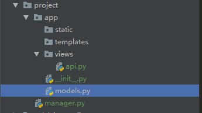

首先建立一个干净的Flask项目:

项目目录如下:

<!--more-->



# Flask-SQLAlchemy第三方组件配置

配置____init____.py文件:

```python
from .views.api import user
from flask import Flask
# 导入Flask-SQLAlchemy中的SQLAlchemy
from flask_sqlalchemy import SQLAlchemy

# 实例化SQLAlchemy;实例化SQLAlchemy的代码必须要在引入蓝图之前
db = SQLAlchemy()

# 引入蓝图


def create_app():
    app = Flask(__name__)

    # 初始化App配置 这个app配置专门针对 SQLAlchemy 进行配置
    # SQLALCHEMY_DATABASE_URI 配置 SQLAlchemy 的链接字符串儿
    app.config["SQLALCHEMY_DATABASE_URI"] = "mysql+pymysql://root:@127.0.0.1:3306/db2019?charset=utf8"
    # SQLALCHEMY_POOL_SIZE 配置 SQLAlchemy 的连接池大小
    app.config["SQLALCHEMY_POOL_SIZE"] = 5
    # SQLALCHEMY_POOL_TIMEOUT 配置 SQLAlchemy 的连接超时时间
    app.config["SQLALCHEMY_POOL_TIMEOUT"] = 15
    app.config["SQLALCHEMY_TRACK_MODIFICATIONS"] = False

    # 初始化SQLAlchemy , 本质就是将以上的配置读取出来
    db.init_app(app)

    app.register_blueprint(user)

    return app
```

models.py文件写入

```python
from app import db

Base = db.Model
# from sqlalchemy.ext.declarative import declarative_base
# Base = declarative_base()
# 每一次我们在创建数据表的时候都要做这样一件事
# 然而Flask-SQLAlchemy已经为我们把 Base 封装好了

# 建立User数据表


class Users(Base):  # Base实际上就是 db.Model
    __tablename__ = "users"
    __table_args__ = {"useexisting": True}
    # 在SQLAlchemy 中我们是导入了Column和数据类型 Integer 在这里
    # 就和db.Model一样,已经封装好了
    id = db.Column(db.Integer, primary_key=True)
    username = db.Column(db.String(32))
    password = db.Column(db.String(32))


if __name__ == '__main__':
    from app import create_app
    app = create_app()
    # 离线脚本:
    with app.app_context():
        db.drop_all()
        db.create_all()
```

api.py文件写入

```python
from flask import Blueprint
from flask import request
from flask import render_template

from app.models import Users
from app import db

user = Blueprint("user", __name__)


@user.route("/login", methods=["POST", "GET"])
def user_login():
    if request.method == "POST":
        username = request.form.get("username")
        password = request.form.get("password")

        # from sqlalchemy.orm import sessionmaker
        # Session = sessionmaker(engine)
        # db_sesson = Session()
        # 现在不用了,因为 Flask-SQLAlchemy 也已经为我们做好会话打开的工作
        db.session.add(Users(username=username, password=password))
        db.session.commit()

        # 然后再查询,捏哈哈哈哈哈
        user_info = Users.query.filter(
            Users.username == username and Users.password == password).first()
        print(user_info.username)
        if user_info:
            return f"登录成功{user_info.username}"

    return render_template("login.html")
```

# Flask-Script 

Flask-Script 从字面意思上来看就是 Flask 的脚本

类似Django的启动命令 python manager.py runserver 大概是这样

##  Flask-Script 加入到 Flask 项目中

```python
import MyApp
# 导入 Flask-Script 中的 Manager
from flask_script import Manager

app = MyApp.create_app()
# 让app支持 Manager
manager = Manager(app)

if __name__ == '__main__':
    #app.run()
    # 替换原有的app.run()
    manager.run()
```

## 使用命令启动 Flask 项目

```python
python manager.py runserver
```

## 启动项目并更改配置参数(监听IP地址,监听端口)

```python
python manager.py runserver -h 0.0.0.0 -p 9527
```

## 自定制脚本命令

@manager.command

```python
import MyApp
# 导入 Flask-Script 中的 Manager
from flask_script import Manager

app = MyApp.create_app()
# 让app支持 Manager
manager = Manager(app) # type:Manager

@manager.command
def Func(arg):
    print(arg)

if __name__ == '__main__':
    #app.run()
    # 替换原有的app.run()
    manager.run()

 python manager.py yao 666
```

@manager.opation("-短指令","--长指令",dest="变量名")

```python
import MyApp
# 导入 Flask-Script 中的 Manager
from flask_script import Manager

app = MyApp.create_app()
# 让app支持 Manager
manager = Manager(app) # type:Manager

@manager.command
def Func(arg):
    print(arg)

@manager.option("-n","--name",dest="name")
@manager.option("-s","--say",dest="say")
def talk(name,say):
    print(f"{name}你可真{say}")

if __name__ == '__main__':
    #app.run()
    # 替换原有的app.run()
    manager.run()

python manager.py talk -n yy -s 漂亮
python manager.py talk --name yao --say NB-Class    
```

# Flask-Migrate

## 将 Flask-Migrate 加入到 Flask 项目中

```python
import MyApp
# 导入 Flask-Script 中的 Manager
from flask_script import Manager

# 导入 Flask-Migrate 中的 Migrate 和 MigrateCommand
# 这两个东西说白了就是想在 Flask-Script 中添加几个命令和指令而已
from flask_migrate import Migrate,MigrateCommand

app = MyApp.create_app()
# 让app支持 Manager
manager = Manager(app) # type:Manager

# Migrate 既然是数据库迁移,那么就得告诉他数据库在哪里
# 并且告诉他要支持那个app
Migrate(app,MyApp.db)
# 现在就要告诉manager 有新的指令了,这个新指令在MigrateCommand 中存着呢
manager.add_command("db",MigrateCommand) # 当你的命令中出现 db 指令,则去MigrateCommand中寻找对应关系
"""
数据库迁移指令:
python manager.py db init 
python manager.py db migrate   # Django中的 makemigration
python manager.py db upgrade  # Django中的 migrate
"""


@manager.command
def Func(arg):
    print(arg)

@manager.option("-n","--name",dest="name")
@manager.option("-s","--say",dest="say")
def talk(name,say):
    print(f"{name}你可真{say}")

if __name__ == '__main__':
    #app.run()
    # 替换原有的app.run()
    manager.run()
```

## 执行数据库初始化指令

```python
python manager.py db init
```