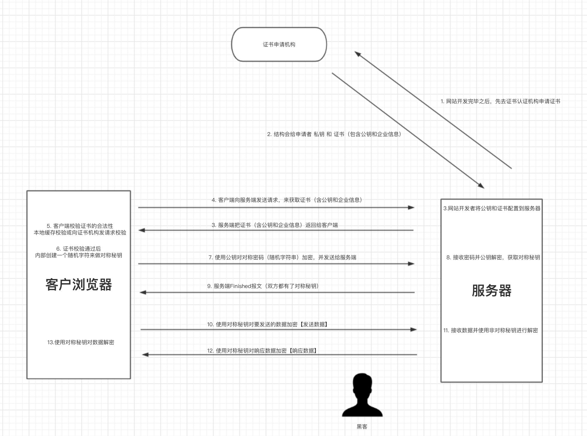

# 准备

下载的Nginx证书压缩文件解压后包含：

- .pem：证书文件。PEM文件的扩展名为CRT格式。
- .key：证书的密钥文件。申请证书时如果未选择**自动创建CRS**，则下载的证书文件压缩包中不会包含.key文件，需要您将自己手动常见的私钥文件拷贝到**cert**目录下。

<!--more-->

# nginx配置

## 证书配置

修改nginx.conf文件

```yaml
# 以下属性中以ssl开头的属性代表与证书配置有关，其他属性请根据自己的需要进行配置。
server {
  listen 443 ssl;
  server_name localhost;  # localhost修改为您证书绑定的域名。
  root html;
  index index.html index.htm;
  ssl_certificate cert/domain name.pem;   #将domain name.pem替换成您证书的文件名。
  ssl_certificate_key cert/domain name.key;   #将domain name.key替换成您证书的密钥文件名。
  ssl_session_timeout 5m;
  ssl_ciphers ECDHE-RSA-AES128-GCM-SHA256:ECDHE:ECDH:AES:HIGH:!NULL:!aNULL:!MD5:!ADH:!RC4;  #使用此加密套件。
  ssl_protocols TLSv1 TLSv1.1 TLSv1.2;   #使用该协议进行配置。
  ssl_prefer_server_ciphers on;   
  location / {
    root html;   #站点目录。
    index index.html index.htm;   
  }
}
```

## 跳转配置

在需要跳转的http站点下添加以下rewrite语句，实现http访问自动跳转到https页面

```yaml
server {
   listen 80;
   server_name localhost;  # localhost修改为您证书绑定的域名。
	 rewrite ^(.*)$ https://$host$1 permanent;
}
```

## tips:

- 配置ssl后网站无法访问?

  - 检查服务器防火墙

    ```
    sudo systemctl stop firewalld    临时关闭
    sudo systemctl disable firewalld 然后reboot 永久关闭
    sudo systemctl status  firewalld 查看防火墙状态。
    ```

  - 检查服务器的安全规则,查看是否开放`443`端口

  - 如果使用容器启动应用,查看是否映射`443`端口

  - 其他,则需通过查看`是否正在监听端口`,`是否ping通`,等等逐步排查

# ssl

https原理:



# continue . . .

