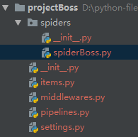

Scrapy是一个为了爬取网站数据，提取结构性数据而编写的应用框架。 可以应用在包括数据挖掘，信息处理或存储历史数据等一系列的程序中。

<!--more-->

# 使用

## Begin

创建scrapy项目:

```
scrapy startproject projectName 
```

创建爬虫文件

```python
cd projectName
scrapy genspider spiderName www.xxx.com  # 一般以域名命名
```

项目目录及文件



- items.py    设置数据存储模板，用于结构化数据，如：Django的Model
- pipelines    数据处理行为，如：一般结构化的数据持久化
- settings.py 配置文件，如：递归的层数、并发数，延迟下载等
- spiders      爬虫目录，如：创建文件，编写爬虫规则

## 解析+持久化存储

### 基于终端指令的持久化存储

spiderBoss.py

```python
# -*- coding: utf-8 -*-
import scrapy


class SpiderbossSpider(scrapy.Spider):
    # 爬虫文件的名称
    name = 'spiderBoss'
    # 允许的域名
    # allowed_domains = ['www.xxx.com']
    # 起始url列表,列表内url,依次在parse方法执行
    start_urls = ['https://www.zhipin.com/c101010100/?query=%E7%88%AC%E8%99%AB&page=1&ka=page-1']

    def parse(self, response):
        result = []
        data_list = response.xpath("//div[@class='job-list']//ul/li")

        # 单个用extract_first,多个使用extract
        for data in data_list:
            job_name = data.xpath("./div/div[1]/h3/a/div/text()").extract_first()
            salary = data.xpath("./div/div[1]/h3/a/span/text()").extract_first()
            company = data.xpath("./div/div[2]/div/h3/a/text()").extract_first()
            dic = {
                "job_name": job_name,
                "salary": salary,
                "company": company
            }
            result.append(dic)
            print(dic)
        return result
ps:
    settings配置解决中文乱码
    FEED_EXPORT_ENCODING = 'GBK'
```

项目启动

```python
scrapy crawl spiderBoss  		    # 正常启动
scrapy crawl spiderBoss --nolog 	# 启动且不显示日志
```

基于终端指令的持久化存储

```
scrapy crawl spiderBoss -o fileName  # 用此命令启动就可实现基于终端指令的持久化存储
# 支持的文件格式
# 'json', 'jsonlines', 'jl', 'csv', 'xml', 'marshal', 'pickle'
```

## 基于管道的持久化存储

spiderBoss.py

```python
# -*- coding: utf-8 -*-
import scrapy

from ..items import ProjectbossItem


class SpiderbossSpider(scrapy.Spider):
    # 爬虫文件的名称
    name = 'spiderBoss'
    # 允许的域名
    # allowed_domains = ['www.xxx.com']
    # 起始url列表,列表内url,依次在parse方法执行
    start_urls = ['https://www.zhipin.com/c101010100/?query=%E7%88%AC%E8%99%AB&page=1&ka=page-1']
    url_page = "https://www.zhipin.com/c101010100/?query=爬虫&page=%s&ka=page-2"
    page = 1

    # 解析+管道持久化存储
    def parse(self, response):
        data_list = response.xpath("//div[@class='job-list']//ul/li")

        # 单个用extract_first,多个使用extract
        for data in data_list:
            # 实例化一个item对象
            item = ProjectbossItem()
            job_name = data.xpath("./div/div[1]/h3/a/div/text()").extract_first()
            salary = data.xpath("./div/div[1]/h3/a/span/text()").extract_first()
            company = data.xpath("./div/div[2]/div/h3/a/text()").extract_first()

            # 将解析到的数据全部封装到item对象中
            item["job_name"] = job_name
            item["salary"] = salary
            item["company"] = company

            # 将item提交给管道
            yield item

        # 分页的请求
        if self.page <= 10:
            self.page += 1
            new_url = format(self.url_page % self.page)
            # 手动发起请求
            yield scrapy.Request(url=new_url, callback=self.parse)

```

items.py

```python
# -*- coding: utf-8 -*-

# Define here the models for your scraped items
#
# See documentation in:
# https://doc.scrapy.org/en/latest/topics/items.html

import scrapy


class ProjectbossItem(scrapy.Item):
    # define the fields for your item here like:
    # name = scrapy.Field()
    job_name = scrapy.Field()
    salary = scrapy.Field()
    company = scrapy.Field()
```

pipelines.py

```python
# -*- coding: utf-8 -*-

# Define your item pipelines here
#
# Don't forget to add your pipeline to the ITEM_PIPELINES setting
# See: https://doc.scrapy.org/en/latest/topics/item-pipeline.html
import pymysql
from redis import Redis


# 存入txt文档
class ProjectbossPipeline(object):

    f = None

    def open_spider(self, spider):
        self.f = open("boss.txt", "w", encoding="utf-8")

    # 爬虫文件每向管道提交一次item,则该方法就会被调用一次.
    # 参数:item 就是管道接收到的item类型对象
    def process_item(self, item, spider):
        self.f.write(item["job_name"] + "----" + item["salary"] + "----" + item["company"]  + "\n")
        # 返回给下一个即将被执行的管道类
        return item

    def close_spider(self, spider):
        self.f.close()


# 存入redis
class RedisbossPipeline(object):

    redis_obj = None

    def open_spider(self, spider):
        self.redis_obj = Redis(host="127.0.0.1", port=6379)

    # 爬虫文件每向管道提交一次item,则该方法就会被调用一次.
    # 参数:item 就是管道接收到的item类型对象
    def process_item(self, item, spider):
        dic = {
            'job_name': item['job_name'],
            'salary': item['salary'],
            'company': item['company']
        }
        self.redis_obj.lpush('boss', dic)
        # 返回给下一个即将被执行的管道类
        return item

# 存入mysql
class MysqlbossPipeline(object):

    mysql_obj = None
    cursor = None

    def open_spider(self, spider):
        self.mysql_obj = pymysql.Connect(host="127.0.0.1", port=3306, user="root", password="", db="db_boss", charset="utf8")

    # 爬虫文件每向管道提交一次item,则该方法就会被调用一次.
    # 参数:item 就是管道接收到的item类型对象
    def process_item(self, item, spider):
        self.cursor = self.mysql_obj.cursor()
        try:
            self.cursor.execute(
                'insert into boss values ("%s","%s","%s")' % (item['job_name'], item['salary'], item['company']))
            self.mysql_obj.commit()
        except Exception as e:
            print(e)
            self.mysql_obj.rollback()
        return item

    def close_spider(self, spider):
        self.mysql_obj.close()
        self.cursor.close()

```

settings.py

```python
# 解决中文乱码
FEED_EXPORT_ENCODING = 'GBK'

BOT_NAME = 'projectBoss'

SPIDER_MODULES = ['projectBoss.spiders']
NEWSPIDER_MODULE = 'projectBoss.spiders'

# User-Agent请求头
# Crawl responsibly by identifying yourself (and your website) on the user-agent
USER_AGENT = 'Mozilla/5.0 (Windows NT 6.1; Win64; x64) AppleWebKit/537.36 (KHTML, like Gecko) Chrome/72.0.3626.119 Safari/537.36'

# 不遵循robots.txt
# Obey robots.txt rules
ROBOTSTXT_OBEY = False

# Configure item pipelines 数字代表优先级,小数优先级高
# See https://doc.scrapy.org/en/latest/topics/item-pipeline.html
ITEM_PIPELINES = {
   'projectBoss.pipelines.ProjectbossPipeline': 300,
   'projectBoss.pipelines.RedisbossPipeline': 301,
   'projectBoss.pipelines.MysqlbossPipeline': 302,
}
```

启动

```
scrapy crawl spiderBoss
```

