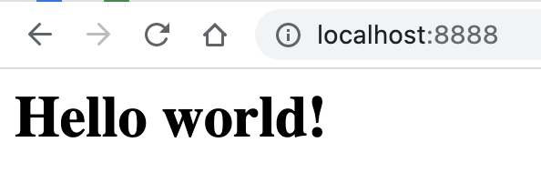

WSGI 是 Web 服务器网关接口。它是一种规范，描述了 Web 服务器如何与 Web 应用程序通信，以及如何将 Web 应用程序链接在一起以处理一个请求。

详细可以访问[PEP 3333](https://www.python.org/dev/peps/pep-3333/)，简单总结就是:

- WSGI 应用程序是可调用的 Python 对象（具有`__call__`方法的函数或类），它们传递了两个参数：
    - environ: 一个包含所有HTTP请求信息的`dict`对象；
    - start_response：一个发送HTTP响应的可调用函数。

作为web应用开发者我们web服务器方面就不过多叙述，仅介绍web应用程序部分。

<!--more-->

# 一个简单的web应用程序

下面是一个简单的wsgi应用程序:

```python
def hello_world(environ, start_response):
    start_response('200 OK', [('Content-Type', 'text/html')])
    return [b"<h1>Hello world!<h1/>"]
```

上面的示例中，调用`start_response`就发送了HTTP响应的Header，注意Header只能发送一次，也就是只能调用一次`start_response()`函数。`start_response()`函数接收两个参数，一个是HTTP响应码，一个是一组`list`表示的HTTP Header，每个Header用一个包含两个`str`的`tuple`表示。

然后，函数的返回值`Hello, world!`将作为HTTP响应的Body发送给浏览器。

有了WSGI，我们关心的就是如何从`environ`这个`dict`对象拿到HTTP请求信息，然后构造HTML，通过`start_response()`发送Header，最后返回Body。

整个`application()`函数本身没有涉及到任何解析HTTP的部分，也就是说，底层代码不需要我们自己编写，我们只负责在更高层次上考虑如何响应请求就可以了。

# 使用web应用程序

上面我们虽然写好了一个web应用程序,可以我们怎么使用它呢？因为我们没有办法给它传递，`environ`和`start_response`俩个参数，而且返回值我们也无法传递给浏览器。

所以`application()`函数必须由WSGI服务器来调用。有很多符合WSGI规范的服务器，比如`uwsgi`, `gunicorn`等等，但是如果只是测试的话，可以使用Python内置的一个WSGI服务器，这个模块叫`wsgiref`，它是用纯Python编写的WSGI服务器的参考实现。所谓“参考实现”是指该实现完全符合WSGI标准，但是不考虑任何运行效率，仅供开发和测试使用。

接下来就通过`wsgiref`来运行上面的示例吧：

```python
from wsgiref.simple_server import make_server
import hello_world


http_server = make_server("", 8888, hello_world)
http_server.serve_forever()
```

结果如图



# 路由分发

```python
import re
from wsgiref.simple_server import make_server


def hello_world(environ, start_response):
    start_response('200 OK', [('Content-Type', 'text/html')])
    return [f'<h1>Hello world! {environ.get("myapp.url_args")}<h1/>'.encode("utf-8")]


url_pattern = [
    (r'hello/?$', hello_world),
    (r'hello/(.+)$', hello_world)
]


def page_not_found(environ, start_response):
    start_response('404 Not Found', [('Content-Type', 'text/html')])
    return [b'<h1>Page Not Found! <h1/>']


def application(environ, start_response):
    url_path = environ["PATH_INFO"].lstrip("/")
    for regex, callback in url_pattern:
        match = re.search(regex, url_path)
        if match is not None:
            environ['myapp.url_args'] = match.groups()
            return callback(environ, start_response)
    return page_not_found(environ, start_response)


if __name__ == '__main__':
    http_server = make_server("", 8888, application)
    http_server.serve_forever()
```

上面的例子中，我们从`environ["PATH_INFO"]	`中获取请求的路径信息，并且定义了俩个路由规则，没有找到的则返回404页面。

# 中间件

middleware对服务器程序和应用是透明的，也就是说，服务器程序以为它就是应用程序，而应用程序以为它就是服务器。这就告诉我们，middleware需要把自己伪装成一个服务器，接受应用程序，调用它，同时middleware还需要把自己伪装成一个应用程序，传给服务器程序。

其实无论是服务器程序，middleware 还是应用程序，都在服务端，为客户端提供服务，之所以把他们抽象成不同层，就是为了控制复杂度，使得每一次都不太复杂，各司其职。

而中间件的作用是将有些可能介于服务器程序和应用程序之间功能，例如下面的例子，所有返回的内容都设置为大写

```
class UpperCaseMiddleware(object):

    def __init__(self, app):
        self.app = app

    def __call__(self, environ, start_response):
        for item in self.app(environ, start_response):
            yield item.upper()
```

那中间该怎么使用呢？很简单只需这样：

```
UpperCaseMiddleware(application)
```

把应用程序传给中间件就可以了。
