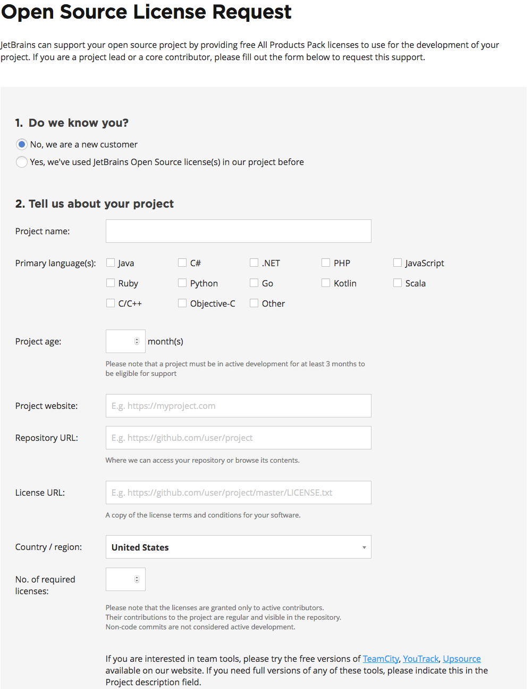
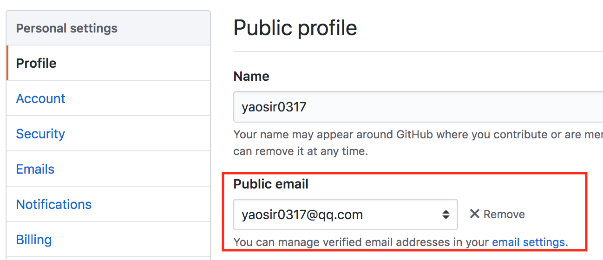
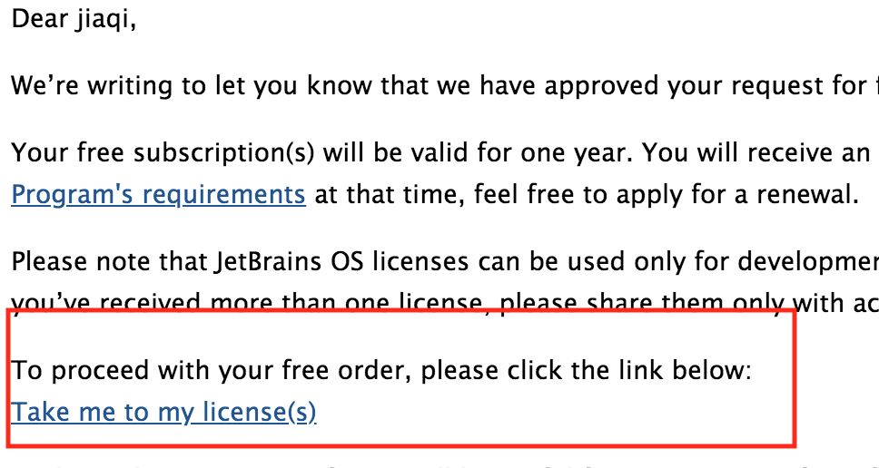
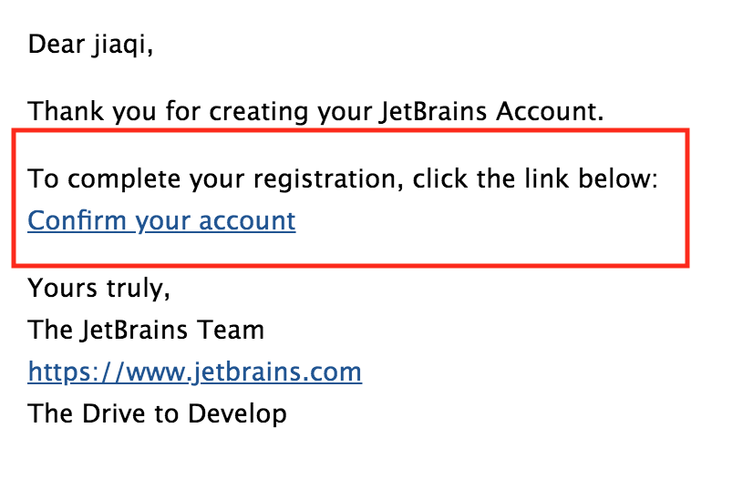
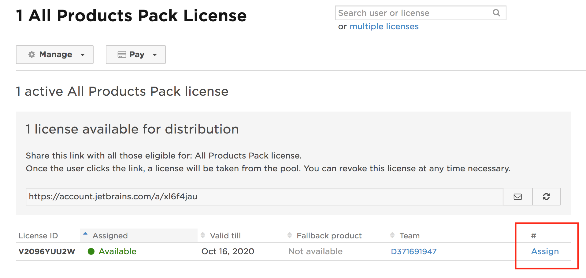
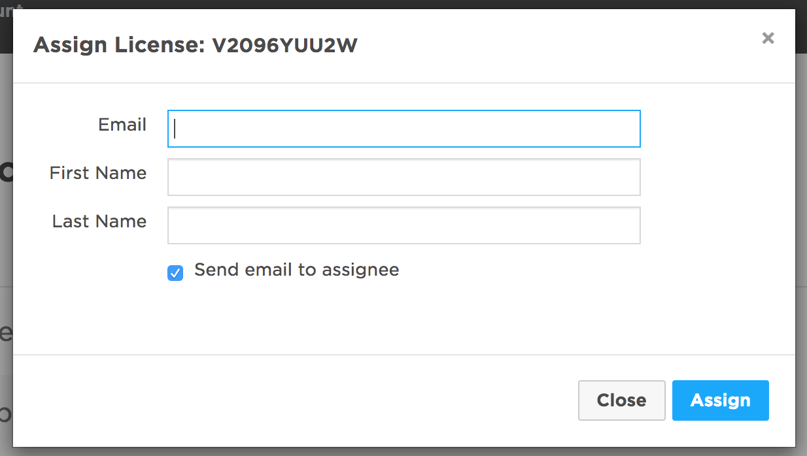
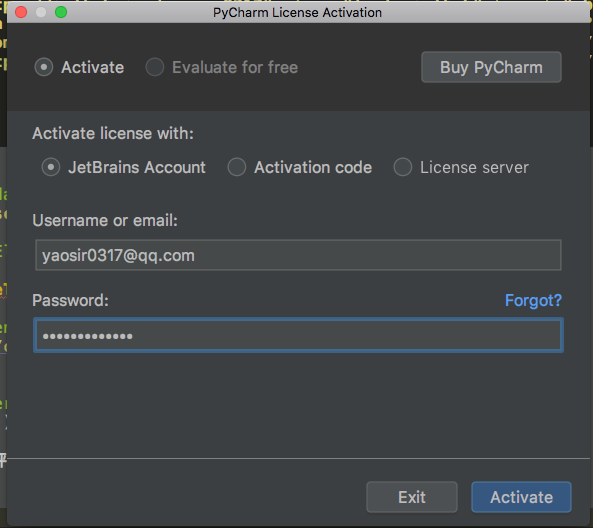

---

title: 获取JetBrains全系产品免费正版License
date: 2019-07-28 15:34:26
tags: tools
categories: 
	- tools
---

# 获取JetBrains全系产品免费正版License

JetBrains是一家捷克的软件开发公司，该公司位于捷克的布拉格，并在俄罗斯的圣彼得堡及美国麻州波士顿都设有办公室，该公司最为人所熟知的产品有：Pycharm, WebStorm, Goland等等。

接下来教大家怎样可以免费获取 jetbrains 的全系产品的正版 License 了，这样就不用担心自己越来越扁的钱包,也不用费时费力的去找破解版本了~~~。

<!--more-->

# 申请

要申请获取免费的正版 License，只有一个前提条件，那就是你需要**有自己的开源项目**，最好是大于三个月的github项目, 新创建的项目可能会申请不成功。

## 项目添加 License

大家可以复制一个到项目中,也可以自行添加, [License 模版](https://github.com/yaosir0317/web/community/license/new?branch=master)

大家请自行搜索如何添加, 此处不在过多陈述.

## 申请表

申请地址： https://www.jetbrains.com/shop/eform/opensource

大家按照要求填写我们的开源项目:

tips：

- Project website：如果你的开源项目有对应的项目地址,填写,如果没有就填写 GitHub 主页地址
- License URL：地址，就是上面我们添加的开源项目的 License 地址
- No. of required licenses：申请的 License 数量，基本上就是你的开源项目有效的代码提交人数
- 最后就是邮箱地址一定不要随便填写，因为在申请过程中和申请结束后都是通过邮箱和我们进行沟通的。

## Github邮箱

上面表格,填写完成后,就可以点击提交.

因为还需要我们在 GitHub 页面上面显示我们的个人邮箱地址，这样可以证明该仓库确实是和邮箱对应的。结下来配置GitHub 显示我们的个人邮箱地址

在我们Github的setting中的Profile填写邮箱地址,此处地址与上一步最后所填写的邮箱一致

# 获取 **License**

上面我们申请完.JetBrains会先给我们发送一封邮件,告诉我们他们收到了申请,让我们等待回复.

我是大概三天后收到的回复,当收到回复时,打开邮件点击`Take me to my license(s)链接`

## 注册

打开上面的链接后,首先要用我们申请时的邮箱注册一个账号,点击`create Account`后

按要求填写注册信息

注册后会发送一封激活邮件，通过激活邮件中的链接进行确认

之后进入 JetBrains 的个人中心，在个人中心我们就可以看到我们申请的开源项目的申请记录,点击你的`项目名字`后就可以进入下面页面,之后点击`Assign`分配账号去使用:

这时候在分配页面填写,前面我们注册的 JetBrains 帐号邮箱信息:

现在我们就可以使用申请的免费 License 了，而且是全系的产品都支持的。

下面以Pycharm为例:

到这里，我们就完成了 JetBrains 全系产品正版 免费 License 的申请和使用。有效期为一年,快要到期时,JetBrains回给我们发送邮件,到时候再进行续签就可以了.