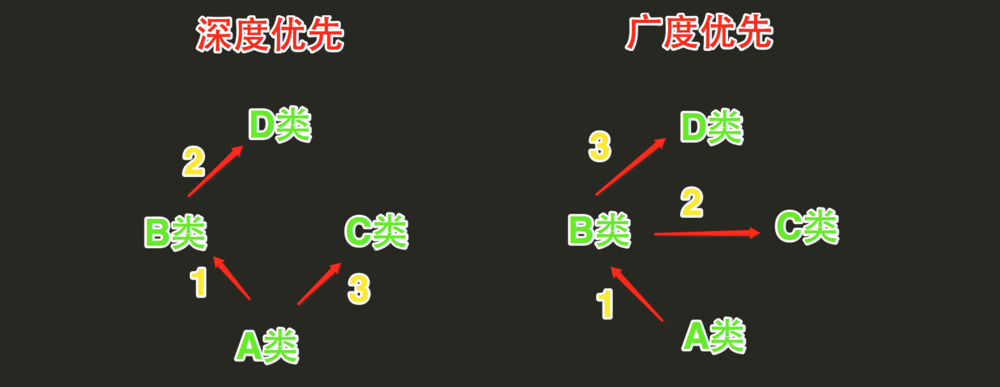
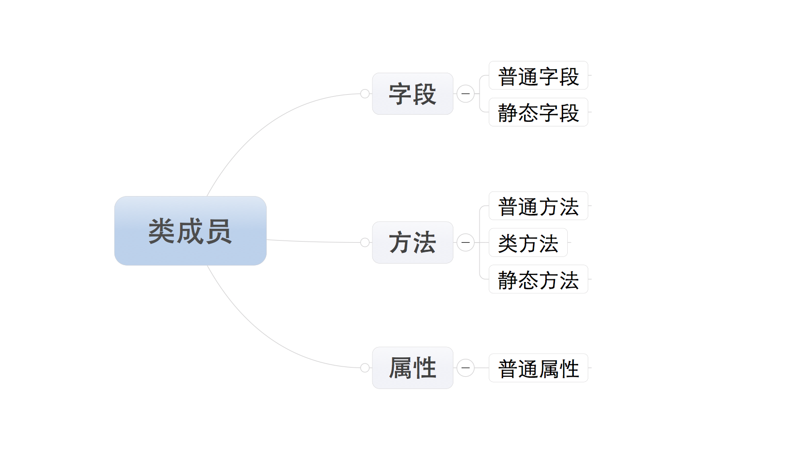

# 面向对象三大特性

## 封装

利用抽象数据类型将数据和基于数据的操作封装在一起，使其构成一个不可分割的独立实体。数据被保护在抽象数据类型的内部，尽可能地隐藏内部的细节，只保留一些对外接口使之与外部发生联系。用户无需知道对象内部的细节，但可以通过对象对外提供的接口来访问该对象。

<!--more-->

### 将内容封装到某处

```python
class Content(object):
    def __init__(self, name, age, hobby):
        self.name = name
        self.age = age
        self.hobby = hobby
obj1=Content("yao",18,"女")
obj1=Content("jia",18,"女")
```

> self 是一个形式参数，当执行obj1=Content("yao",18,"女")时，self 等于 obj1;当执行obj1=Content("jia",18,"女") 时，self 等于 obj2
>
> 所以，内容其实被封装到了对象 obj1 和 obj2 中，每个对象中都有 name , age 和 hobby 属性

### 将方法封装到某处

```python
class Animal(object):
    def __init__(self, name):
        self.name = name
    def eating(self):
    	print(self.name + "can eating")
    def drinking(self):
    	print(self.name + "can drinking")
obj = Animal("cat")
```

### 调用

- 通过对象直接调用

    ```python
    obj1.name # 直接调用obj1对象的name属性
    obj2.age # 直接调用obj2对象的age属性
    ```

- 通过self间接调用

    执行类中的方法时，需要通过self间接调用被封装的内容

    ```python
    obj.drinking() # Python默认会将obj传给self参数，即：obj.drinking(obj)，所以，此时方法内部的 self ＝ obj，即：self.name 是 cat
    ```


## 继承

继承应该遵循里氏替换原则，子类对象必须能够替换掉所有父类对象。

```python
class Animal(object):
    def __init__(self, name):
        self.name = name
    
    def eating(self):
        print(self.name + "can eating")
        
    def drinking(self):
        print(self.name + "can drinking")


class Cat(Animal):
    def cat_sound(self):
        print("喵")


class Dog(Animal):
    def dog_sound(self):
        print("汪")
```

对于面向对象的继承来说，其实就是将多个类共有的方法提取到`父类`中，`子类`仅需继承`父类`而不必一一实现每个方法。除了子类和父类的称谓，你可能看到过 `派生类` 和 `基类` ，他们与`子类`和`父类`只是叫法不同而已。

### 多继承

Java和C#中则只能继承一个类,而Python的类可以继承多个类;Python的类如果继承了多个类，那么其寻找方法的方式有两种，分别是：**深度优先**和**广度优先**



- 当类是经典类时，多继承情况下，会按照深度优先方式查找
- 当类是新式类时，多继承情况下，会按照广度优先方式查找

从写法上区分的话，如果 **当前类或者父类继承了object类**，那么该类便是新式类，否则便是经典类。

**经典类多继承**:

```python
class D:

    def bar(self):
        print 'D.bar'


class C(D):

    def bar(self):
        print 'C.bar'


class B(D):

    def bar(self):
        print 'B.bar'


class A(B, C):

    def bar(self):
        print 'A.bar'

a = A()
a.bar()
# 执行bar方法时
# 首先去A类中查找，如果A类中没有，则继续去B类中找，如果B类中没有，则继续去D类中找，如果D类中没有，则继续去C类中找，如果还是未找到，则报错
# 所以，查找顺序：A --> B --> D --> C
# 在上述查找bar方法的过程中，一旦找到，则寻找过程立即中断，便不会再继续找了
a.bar()
```

**新式类多继承**:

```python
class D(object):

    def bar(self):
        print 'D.bar'


class C(D):

    def bar(self):
        print 'C.bar'


class B(D):

    def bar(self):
        print 'B.bar'


class A(B, C):

    def bar(self):
        print 'A.bar'

a = A()
# 执行bar方法时
# 首先去A类中查找，如果A类中没有，则继续去B类中找，如果B类中没有，则继续去C类中找，如果C类中没有，则继续去D类中找，如果还是未找到，则报错
# 所以，查找顺序：A --> B --> C --> D
# 在上述查找bar方法的过程中，一旦找到，则寻找过程立即中断，便不会再继续找了
a.bar()
```

## **多态** 

Pyhon不支持Java和C#这一类强类型语言中多态的写法，但是原生多态，其Python崇尚“鸭子类型”。

```python
class F1:
    pass


class S1(F1):

    def show(self):
        print 'S1.show'


class S2(F1):

    def show(self):
        print 'S2.show'

def Func(obj):
    print obj.show()

s1_obj = S1()
Func(s1_obj) 

s2_obj = S2()
Func(s2_obj) 

Python “鸭子类型”
```

# 类的成员

类的成员可以分为三大类：字段、方法和属性



所有成员中，只有普通字段的内容保存对象中，即：根据此类创建了多少对象，在内存中就有多少个普通字段。而其他的成员，则都是保存在类中，即：无论对象的多少，在内存中只创建一份。

## 字段

字段包括：普通字段和静态字段，他们在定义和使用中有所区别，而最本质的区别是内存中保存的位置不同

- 普通字段属于**对象**
- 静态字段属于**类**

**字段的定义和使用**:

```python
class Province(object):

    # 静态字段
    country ＝ '中国'

    def __init__(self, name):

        # 普通字段
        self.name = name


# 直接访问普通字段
obj = Province('河北省')
print(obj.name)

# 直接访问静态字段
Province.country
```

**内存中的位置**:

- 静态字段在内存中只保存一份
- 普通字段在每个对象中都要保存一份

## 方法

方法包括：普通方法、静态方法和类方法，三种方法在**内存中都归属于类**，区别在于调用方式不同。

- 普通方法：由**对象**调用；至少一个**self**参数；执行普通方法时，自动将调用该方法的**对象**赋值给**self**；
- 类方法：由**类**调用； 至少一个**cls**参数；执行类方法时，自动将调用该方法的**类**复制给**cls**；
- 静态方法：由**类**调用；无默认参数；

**方法的定义和使用:**

```python
class Foo(object):

    def __init__(self, name):
        self.name = name

    def com_func(self):
        """ 定义普通方法，至少有一个self参数 """
        print('普通方法')

    @classmethod
    def class_func(cls):
        """ 定义类方法，至少有一个cls参数 """
        print('类方法')

    @staticmethod
    def static_func():
        """ 定义静态方法 ，无默认参数"""
        print('静态方法')


# 通过对象调用普通方法
f = Foo("yao")
f.com_func()

# 通过类名调用类方法
Foo.class_func()

# 通过类名调用静态方法
Foo.static_func()
```

## 属性

Python中的属性其实是**普通方法**的变种。

**属性的基本使用:**

```python
class Foo(object):

    def func(self):
        pass

    # 定义属性
    @property
    def prop(self):
        pass
# ############### 调用 ###############
foo_obj = Foo()

foo_obj.func()  #调用方法
foo_obj.prop   #调用属性
```

**注意:**

- 定义时，在普通方法的基础上添加 **@property** 装饰器；
- 定义时，属性**仅有一个**self参数
- 调用时，无需**括号**
    ​           方法：foo_obj.func()
    ​           属性：foo_obj.prop
- 属性存在意义是：访问属性时可以制造出和访问字段完全相同的假象
- Python的属性的功能是：属性内部进行一系列的逻辑计算，最终将计算结果返回。

**装饰器方式使用构建属性**

- 经典类中的属性只有一种访问方式，其对应被 @property 修饰的方法
- 新式类中的属性有三种访问方式，并分别对应了三个被@property、@方法名.setter、@方法名.deleter修饰的方法

```python
class Goods(object):

    @property
    def price(self):
        print '@property'

    @price.setter
    def price(self, value):
        print '@price.setter'

    @price.deleter
    def price(self):
        print '@price.deleter'

# ############### 调用 ###############
obj = Goods()

obj.price          # 自动执行 @property 修饰的 price 方法，并获取方法的返回值

obj.price = 123    # 自动执行 @price.setter 修饰的 price 方法，并将  123 赋值给方法的参数

del obj.price      # 自动执行 @price.deleter 修饰的 price 方法
```

由于新式类中具有三种访问方式，我们可以根据他们几个属性的访问特点，分别将三个方法定义为对同一个属性：获取、修改、删除

```python
class Goods(object):

    def __init__(self):
        # 原价
        self.original_price = 100
        # 折扣
        self.discount = 0.8

    @property
    def price(self):
        # 实际价格 = 原价 * 折扣
        new_price = self.original_price * self.discount
        return new_price

    @price.setter
    def price(self, value):
        self.original_price = value

    @price.deltter
    def price(self, value):
        del self.original_price

obj = Goods()
obj.price         # 获取商品价格
obj.price = 200   # 修改商品原价
del obj.price     # 删除商品原价
```

**静态字段方式构造属性**

```python
class Foo(object):

    def get_bar(self):
        return '属性'

    BAR = property(get_bar)

obj = Foo()
reuslt = obj.BAR        # 自动调用get_bar方法，并获取方法的返回值
print(reuslt)
```

property的构造方法中有个四个参数

- 第一个参数是**方法名**，调用 `对象.属性` 时自动触发执行方法
- 第二个参数是**方法名**，调用 `对象.属性 ＝ XXX` 时自动触发执行方法
- 第三个参数是**方法名**，调用 `del 对象.属性` 时自动触发执行方法
- 第四个参数是**字符串**，调用 `类.属性.__doc__` ，此参数是该属性的描述信息

```python
class Foo(object)：

    def get_bar(self):
        return '属性'

    # *必须两个参数
    def set_bar(self, value): 
        return 'set value' + value

    def del_bar(self):
        return 'property'

    BAR ＝ property(get_bar, set_bar, del_bar, 'description...')

obj = Foo()

obj.BAR              # 自动调用第一个参数中定义的方法：get_bar
obj.BAR = "yao"      # 自动调用第二个参数中定义的方法：set_bar方法，并将“yao”当作参数传入
del obj.BAR          # 自动调用第三个参数中定义的方法：del_bar方法
Foo.BAR.__doc__      # 自动获取第四个参数中设置的值：description...
```

## 类成员的修饰符

对于每一个类的成员而言都有两种形式：

- 公有成员，在任何地方都能访问
- 私有成员，只有在类的内部才能方法

私有成员命名时，前两个字符是下划线。（特殊成员除外，例如：______init______、______call______、______dict______等）

```python
class C(object):
 
    def __init__(self):
        self.name = '公有字段'
        self.__foo = "私有字段"
```

### 私有成员和公有成员的访问限制不同：

**静态字段**

- 公有静态字段：类可以访问；类内部可以访问；派生类中可以访问

    ```python
    class C(object):
    
        name = "公有静态字段"
    
        def func(self):
            print(C.name)
    
    class D(C):
    
        def show(self):
            print(C.name)
    
    
    C.name         # 类访问
    
    obj = C()
    obj.func()     # 类内部可以访问
    
    obj_son = D()
    obj_son.show() # 派生类中可以访问
    ```

- 私有静态字段：仅类内部可以访问

    ```python
    class C(object):
    
        __name = "公有静态字段"
    
        def func(self):
            print C.__name
    
    class D(C):
    
        def show(self):
            print C.__name
    
    
    C.__name       # 类访问            ==> 错误
    
    obj = C()
    obj.func()     # 类内部可以访问     ==> 正确
    
    obj_son = D()
    obj_son.show() # 派生类中可以访问   ==> 错误
    ```

    **普通字段**

    - 公有普通字段：对象可以访问；类内部可以访问；派生类中可以访问

        ```python
        class C(object):
            
            def __init__(self):
                self.foo = "公有字段"
        
            def func(self):
                print(self.foo) 　#　类内部访问
        
        class D(C):
            
            def show(self):
                print(self.foo)　# 派生类中访问
        
        obj = C()
        
        obj.foo     # 通过对象访问
        obj.func()  # 类内部访问
        
        obj_son = D();
        obj_son.show()  # 派生类中访问
        ```

    - 私有普通字段：仅类内部可以访问

        ```python
        class C(object):
            
            def __init__(self):
                self.__foo = "私有字段"
        
            def func(self):
                print(self.foo) 　#　类内部访问
        
        class D(C):
            
            def show(self):
                print (self.foo)　# 派生类中访问
        
        obj = C()
        
        obj.__foo     # 通过对象访问    ==> 错误
        obj.func()  # 类内部访问        ==> 正确
        
        obj_son = D();
        obj_son.show()  # 派生类中访问  ==> 错误
        ```

        **方法、属性的访问于上述方式相似，即：私有成员只能在类内部使用**

# 类的特殊成员

## ______doc______

表示类的描述信息

```python
class Foo(object):
    """ 描述类信息 """

    def func(self):
        pass

print(Foo.__doc__)
# 输出：类的描述信息
```

